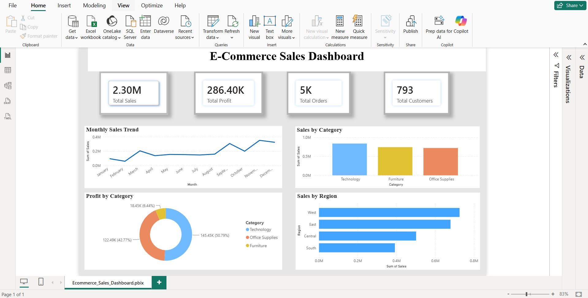

# 📊 E-Commerce Sales Analytics
End-to-End Data Analytics Project | Excel | SQL | Python | Power BI

An end-to-end Data Analytics project that analyzes Superstore sales data using Excel, SQL, Python, and Power BI. The project focuses on data cleaning, business insights, and interactive dashboard creation to support data-driven decision-making.

---

## 📌 Project Overview

This project analyzes an E-Commerce Superstore dataset to identify sales trends, profit performance, customer behavior, regional performance, and category-wise insights.

The project demonstrates the complete Data Analytics workflow:

- Data Cleaning
- Data Analysis
- Data Visualization
- Business Insights
- Dashboard Development

---

## 🛠️ Tools & Technologies

- Microsoft Excel
- SQL
- Python
- Pandas
- NumPy
- Matplotlib
- Power BI

---

## 📂 Project Structure

```
Ecommerce-Sales-Analytics
│
├── Dataset
│   ├── Sample - Superstore.xls
│   └── SuperstoreSales.csv
│
├── Excel
│   └── Superstore_Analysis.xlsx
│
├── SQL
│   └── Superstore_SQL_Analysis.sql
│
├── Python
│   └── Superstore_Analysis.ipynb
│
├── PowerBI
│   └── Ecommerce_Sales_Dashboard.pbix
│
├── Images
│   └── ecommerce_sales_dashboard.png
│
└── README.md
```

---

## 📈 Dashboard Preview



---

## 📊 Key Performance Indicators (KPIs)

- Total Sales
- Total Profit
- Total Orders
- Total Customers

---

## 📈 Dashboard Insights

- Monthly Sales Trend
- Sales by Category
- Profit by Category
- Sales by Region

---

## 📌 Business Insights

- Technology generated the highest sales.
- The West region recorded the highest sales performance.
- Office Supplies contributed strong profit despite comparatively lower sales.
- Monthly sales showed noticeable seasonal fluctuations.

---

## 🚀 Project Workflow

1. Data Collection
2. Data Cleaning using Excel & Python
3. SQL Data Analysis
4. Exploratory Data Analysis (EDA)
5. Dashboard Development in Power BI
6. Business Insight Generation

---

## 💡 Skills Demonstrated

- Data Cleaning
- Data Analysis
- Data Visualization
- Dashboard Design
- SQL Queries
- Exploratory Data Analysis (EDA)
- Business Intelligence
- Power BI
- Python Programming

---

## 👩‍💻 Author

**Tanvee Durafe**

LinkedIn: linkedin.com/in/tanveedurafe

GitHub: https://github.com/tanveeeD
